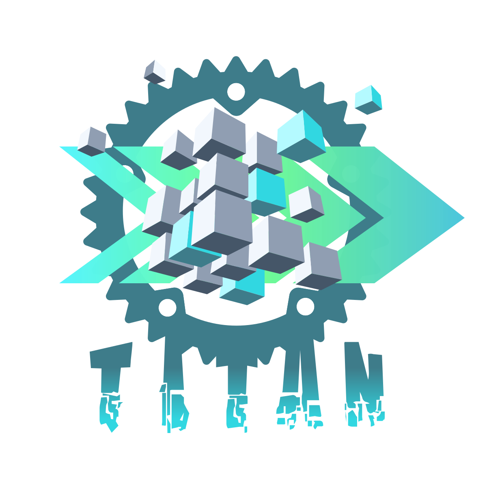

<div align="center">
  <span></span>
</div>

## Titan: Minimal, Explicit and Simplistic ECS in Rust

Titan aims to be a minimal yet useful [Entity Component System](https://en.wikipedia.org/wiki/Entity_component_system) library, supporting full serialization and deserialization of stored data. The library is entirely written in Rust.

Other ECSs tend to be heavy and overly complicated. The core tenets of an ECS is that bundles of components can be spawned and removed, and that bundles containing specific sets of components can be iterated over quickly. Titan uses an `archetype` layout for component data, so adding and removing of components are slow in comparison to direct component vecs. However, this allows very fast component iteration, which is arguably the most important consideration for an ECS. 

Titan aims to let you organize your data into components and allows you to iterate over those components quickly. Since the implementation of such a structure is non-trivial, Titan has a thin Serialization / Deserialization layer built in to avoid complex type management for the library consumer.

A persistent ECS, that's what Titan is, nothing more, nothing less.

### Example

```rust
use titan::ResultIteration;
use titan::ECS;
use titan_macros::component;

fn main() {
    // Create main ECS instance.
    let mut ecs = ECS::default();

    // Register each individual component.
    ecs.register_component::<Id>();
    ecs.register_component::<Position>();
    ecs.register_component::<Person>();

    // Register each archetype which is a unique component combination.
    ecs.register_archetype::<(Id, Position)>();
    ecs.register_archetype::<(Id, Position, Person)>();

    // Spawn entities, 2 of archetype (Id, Position, Person) and 1 of archetype (Id, Position).
    // Note, order of components in the bundle does not matter.
    ecs.spawn_bundle((
        Person {
            age: 34,
            height: 175,
            weight: 75,
        },
        Id(23),
        Position { x: -34.5, y: 88.1 },
    ));
    ecs.spawn_bundle((
        Id(91),
        Position { x: 7.1, y: 12.9 },
        Person {
            age: 24,
            height: 160,
            weight: 68,
        },
    ));
    ecs.spawn_bundle((Position { x: 103.4, y: -71.7 }, Id(55)));

    // Query for specific archetypes. & asks for read permission, whereas &mut requests write
    // permission. Note, once again the order does not matter.
    for (id, person, position) in ecs
        .query::<(&Id, &mut Person, &mut Position)>()
        .result_iter()
    {
        println!(
            "{:?} is at {:?} and has a height of {}",
            id, position, person.height
        );

        // We can also mutate components which were requested with &mut.
        position.x = 0.0;
    }

    // Serialize the component storage into JSON.
    let ecs_serial = ecs.serialize();

    // Create a new ECS into which we will deserialize the previous ECS.
    let mut ecs_2 = ECS::default();

    // Once again we register the components into the new ECS. This would usually be done on
    // startup. Since you won't have more than 1 ECS instance, you do not need to register
    // components multiple times.
    ecs_2.register_component::<Id>();
    ecs_2.register_component::<Position>();
    ecs_2.register_component::<Person>();
    ecs_2.register_archetype::<(Id, Position)>();
    ecs_2.register_archetype::<(Id, Position, Person)>();

    // Deserialize the 'saved' ECS into the new ECS instance.
    ecs_2.deserialize(&ecs_serial);

    // Query new ECS and print deserialized components that match query.
    for (id, person, position) in ecs
        .query::<(&Id, &mut Person, &mut Position)>()
        .result_iter()
    {
        println!(
            "{:?} is at {:?} and has a height of {}",
            id, position, person.height
        );
    }
}

#[component]
struct Id(u32);

#[component]
struct Position {
    x: f32,
    y: f32,
}

#[component]
struct Person {
    age: u8,
    height: u16,
    weight: u16,
}
```

### Structure

Due to the need for proc-macros, the tests and examples are extracted into their own crates with dependencies similar to what the library consumer would have. Tests can be run with:

```bash
cd titan/tests
cargo test
```

Examples are available in the `titan/example` crate. 

### Development

- [x] Manual Registation of Components and Archetypes
- [x] Spawn component Bundles
- [x] Serialize and Deserialize storage
- [x] Iterate Archetypes
- [x] Iterate based on Filter 
- [ ] Remove entities
- [ ] Access entity id in query iteration
- [x] Derive macro for components which auto implements Serialize / Deserialize 
- [ ] Ensure full test suite 
- [ ] Ensure full documentation
